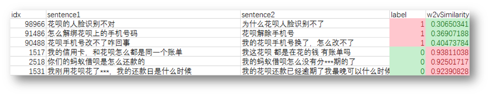
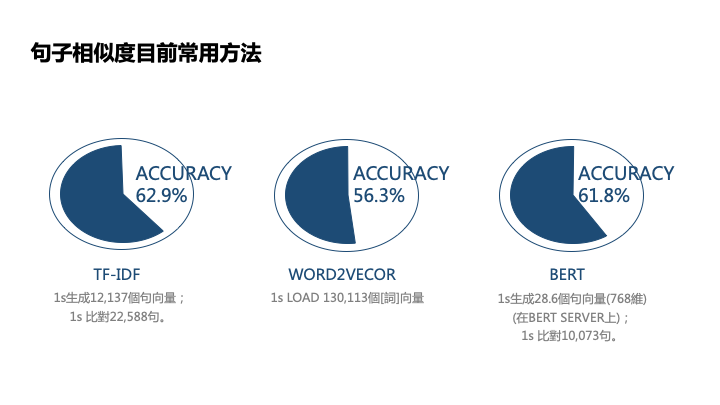

# SentenceSimilarity
Comparing Sentence Embedding Models

## 句子相似度計算模型比較 Sentence Similarity Model Comparison

Data Source: [螞蟻金融NLP競賽](https://dc.cloud.alipay.com/index?click_from=MAIL&_bdType=acafbbbiahdahhadhiih#/topic/intro?id=3)

- 使用三種Model生成Sentence Vector:
	- TF-IDF
	- Word2Vec
	- BERT
- 計算Sentence Pair的相似度
- 設定Threshold值，輸出同義/不同義
- 比較判斷準確度Accuracy

